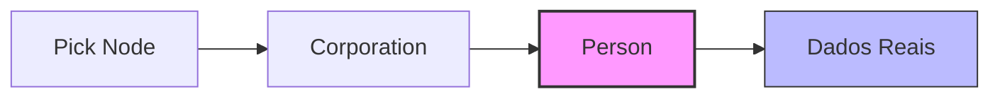

# 📘 Documentação Técnica: Mapeamento de Filiais em Coletas (Pick)

**Contexto:**
Diferente do módulo de Fretes (onde os dados da filial são diretos), no módulo de **Coletas**, a entidade `Corporation` atua como um *wrapper*. Os dados cadastrais reais (Nome Fantasia, CNPJ) estão encapsulados dentro de um sub-objeto chamado `person`.

Tentativas de acessar `corporation.nickname` ou `corporation.cnpj` diretamente resultarão em erro de validação do Schema.

### 1\. Diagrama de Estrutura do Objeto

A hierarquia correta para acesso aos dados é:



  * **Pick:** Objeto Raiz da Coleta.
  * **Corporation:** Objeto de relacionamento da Filial.
  * **Person (CRÍTICO):** Objeto que contém a identidade jurídica.
  * **Nickname/CNPJ:** Campos finais de texto.

-----

### 2\. Campos e Mapeamento (De/Para)

Utilize estes caminhos para sua integração (Java/C\#/ETL):

| Dado de Negócio | Caminho no JSON (`node...`) | Tipo | Descrição |
| :--- | :--- | :--- | :--- |
| **ID da Filial** | `corporation.id` | `Int` | Identificador interno do sistema. |
| **Nome Fantasia** | `corporation.person.nickname` | `String` | Ex: "CWB - RODOGARCIA...". Usado para identificar visualmente a unidade. |
| **CNPJ** | `corporation.person.cnpj` | `String` | Identificador fiscal (apenas números ou formatado). |
| **Razão Social** | `corporation.person.name` | `String` | Nome jurídico da empresa. |

-----

### 3\. Exemplo de Query GraphQL (Snippet)

Copie este bloco para garantir a extração correta:

```graphql
query GetColetaBranchData {
  pick(first: 100, params: {}) {
    edges {
      node {
        id
        status
        
        # --- BLOCO DE FILIAL (Branch) ---
        corporation {
          id
          # Acesso Obrigatório via 'person'
          person {
            nickname  # Nome da Filial (Ex: SPO - MATRIZ)
            name      # Razão Social
            cnpj      # 00.000.000/0000-00
          }
        }
        # --------------------------------
      }
    }
  }
}
```

### 4\. Diferença vs. Módulo de Fretes

É crucial que o desenvolvedor note a inconsistência entre os módulos para não reutilizar a classe errada:

  * ❌ **Em Fretes (`Freight`):** `corporation.nickname` (Acesso direto).
  * ✅ **Em Coletas (`Pick`):** `corporation.person.nickname` (Acesso aninhado).

### 5\. Tratamento de Erros Comuns

  * **Erro:** `Field 'nickname' doesn't exist on type 'Corporation'`
      * **Causa:** O desenvolvedor tentou acessar o campo direto na raiz da Corporation.
      * **Solução:** Adicionar o nível `.person` na query.
  * **Erro:** `Field 'corporationId' doesn't exist`
      * **Causa:** O módulo Pick não expõe o ID como campo escalar na raiz.
      * **Solução:** Solicitar `corporation { id }`.